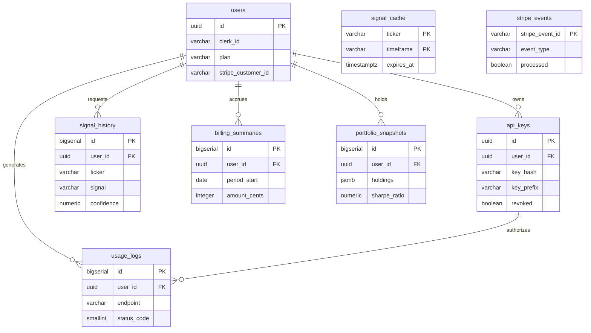

# SIGMA — Database Schema

> PostgreSQL 15 + TimescaleDB extension.
> Run migrations in order. Never edit existing migrations — always add new ones.

---

## Entity Relationships



> `signal_history` and `portfolio_snapshots` are TimescaleDB hypertables (partitioned by `created_at`). `signal_cache` and `stripe_events` stand alone — keyed by business identity, not `user_id`.

### Migration map

| Migration | Tables added |
| --- | --- |
| 001 | `users`, `api_keys`, `usage_logs` |
| 002 | `signal_history` (hypertable), `signal_cache` |
| 003 | `stripe_events`, `billing_summaries` |
| 004 | `portfolio_snapshots` (hypertable) |

---

## Migration 001 — Initial Schema

```sql
-- 001_initial_schema.sql

CREATE EXTENSION IF NOT EXISTS "uuid-ossp";

-- Users (managed by Clerk, mirrored here for FK integrity)
CREATE TABLE users (
  id            UUID PRIMARY KEY DEFAULT uuid_generate_v4(),
  clerk_id      VARCHAR(255) UNIQUE NOT NULL,       -- Clerk user ID
  email         VARCHAR(255) UNIQUE NOT NULL,
  plan          VARCHAR(50) NOT NULL DEFAULT 'free', -- free | pro | enterprise
  stripe_customer_id VARCHAR(255) UNIQUE,
  stripe_subscription_id VARCHAR(255) UNIQUE,
  created_at    TIMESTAMPTZ NOT NULL DEFAULT NOW(),
  updated_at    TIMESTAMPTZ NOT NULL DEFAULT NOW()
);

-- API keys
CREATE TABLE api_keys (
  id            UUID PRIMARY KEY DEFAULT uuid_generate_v4(),
  user_id       UUID NOT NULL REFERENCES users(id) ON DELETE CASCADE,
  key_hash      VARCHAR(255) UNIQUE NOT NULL,        -- SHA-256 hash of the raw key
  key_prefix    VARCHAR(12) NOT NULL,                -- e.g. "sk_live_abc1" for display
  name          VARCHAR(100),                        -- user-given label
  last_used_at  TIMESTAMPTZ,
  expires_at    TIMESTAMPTZ,                         -- NULL = never expires
  revoked       BOOLEAN NOT NULL DEFAULT FALSE,
  created_at    TIMESTAMPTZ NOT NULL DEFAULT NOW()
);

-- Per-request usage log (feeds Stripe metering + analytics)
CREATE TABLE usage_logs (
  id            BIGSERIAL PRIMARY KEY,
  user_id       UUID NOT NULL REFERENCES users(id) ON DELETE CASCADE,
  api_key_id    UUID REFERENCES api_keys(id) ON DELETE SET NULL,
  endpoint      VARCHAR(100) NOT NULL,              -- e.g. /signals, /portfolio/rebalance
  ticker        VARCHAR(20),
  response_ms   INTEGER,                            -- latency in milliseconds
  status_code   SMALLINT NOT NULL,
  error_msg     TEXT,
  created_at    TIMESTAMPTZ NOT NULL DEFAULT NOW()
);

-- Indexes
CREATE INDEX idx_api_keys_user_id      ON api_keys(user_id);
CREATE INDEX idx_api_keys_key_hash     ON api_keys(key_hash);
CREATE INDEX idx_usage_logs_user_id    ON usage_logs(user_id);
CREATE INDEX idx_usage_logs_created_at ON usage_logs(created_at DESC);
```

---

## Migration 002 — TimescaleDB + Signal History

```sql
-- 002_timescaledb.sql

CREATE EXTENSION IF NOT EXISTS timescaledb CASCADE;

-- Signal history (time-series — becomes a hypertable)
CREATE TABLE signal_history (
  id            BIGSERIAL,
  user_id       UUID NOT NULL REFERENCES users(id) ON DELETE CASCADE,
  ticker        VARCHAR(20) NOT NULL,
  timeframe     VARCHAR(10) NOT NULL DEFAULT 'daily', -- daily | 4h | hourly
  signal        VARCHAR(10) NOT NULL,                 -- BUY | SELL | HOLD
  confidence    NUMERIC(5,4) NOT NULL,                -- 0.0000 to 1.0000
  predicted_return NUMERIC(8,6),                     -- expected % return
  model_version VARCHAR(20) NOT NULL,
  features      JSONB,                                -- feature vector snapshot
  created_at    TIMESTAMPTZ NOT NULL DEFAULT NOW(),
  PRIMARY KEY (id, created_at)
);

-- Convert to TimescaleDB hypertable (partitions by month automatically)
SELECT create_hypertable('signal_history', 'created_at');

-- Signal cache (keyed by ticker + timeframe — avoid redundant ML calls)
CREATE TABLE signal_cache (
  ticker        VARCHAR(20) NOT NULL,
  timeframe     VARCHAR(10) NOT NULL DEFAULT 'daily',
  signal        VARCHAR(10) NOT NULL,
  confidence    NUMERIC(5,4) NOT NULL,
  predicted_return NUMERIC(8,6),
  model_version VARCHAR(20) NOT NULL,
  expires_at    TIMESTAMPTZ NOT NULL,
  created_at    TIMESTAMPTZ NOT NULL DEFAULT NOW(),
  PRIMARY KEY (ticker, timeframe)
);

-- Indexes
CREATE INDEX idx_signal_history_user_ticker ON signal_history(user_id, ticker, created_at DESC);
CREATE INDEX idx_signal_history_ticker      ON signal_history(ticker, created_at DESC);
```

---

## Migration 003 — Billing Events

```sql
-- 003_billing_events.sql

-- Stripe event log (idempotency — avoid double-processing webhooks)
CREATE TABLE stripe_events (
  stripe_event_id VARCHAR(255) PRIMARY KEY,         -- Stripe event ID
  event_type      VARCHAR(100) NOT NULL,
  processed       BOOLEAN NOT NULL DEFAULT FALSE,
  processed_at    TIMESTAMPTZ,
  raw_payload     JSONB,
  created_at      TIMESTAMPTZ NOT NULL DEFAULT NOW()
);

-- Billing period summary (pre-aggregated for dashboard display)
CREATE TABLE billing_summaries (
  id              BIGSERIAL PRIMARY KEY,
  user_id         UUID NOT NULL REFERENCES users(id) ON DELETE CASCADE,
  period_start    DATE NOT NULL,
  period_end      DATE NOT NULL,
  api_calls       INTEGER NOT NULL DEFAULT 0,
  signals_count   INTEGER NOT NULL DEFAULT 0,
  amount_cents    INTEGER NOT NULL DEFAULT 0,        -- in USD cents
  invoice_id      VARCHAR(255),
  created_at      TIMESTAMPTZ NOT NULL DEFAULT NOW(),
  UNIQUE(user_id, period_start)
);

CREATE INDEX idx_billing_summaries_user ON billing_summaries(user_id, period_start DESC);
```

---

## Migration 004 — Portfolio

```sql
-- 004_portfolio_snapshots.sql

-- User portfolio snapshots
CREATE TABLE portfolio_snapshots (
  id              BIGSERIAL,
  user_id         UUID NOT NULL REFERENCES users(id) ON DELETE CASCADE,
  holdings        JSONB NOT NULL,                   -- {"AAPL": 1000, "MSFT": 2500}
  total_value     NUMERIC(15,2),
  optimization_method VARCHAR(50),                  -- mvo | quantum_qaoa | equal_weight
  target_allocation JSONB,                          -- {"AAPL": 0.40, "MSFT": 0.60}
  recommended_trades JSONB,                         -- [{"ticker": "AAPL", "action": "BUY", "amount": 500}]
  sharpe_ratio    NUMERIC(8,4),
  created_at      TIMESTAMPTZ NOT NULL DEFAULT NOW(),
  PRIMARY KEY (id, created_at)
);

SELECT create_hypertable('portfolio_snapshots', 'created_at');

CREATE INDEX idx_portfolio_snapshots_user ON portfolio_snapshots(user_id, created_at DESC);
```

---

## Key Design Decisions

| Decision | Rationale |
|----------|-----------|
| UUID primary keys | Avoids sequential ID enumeration attacks on API |
| `key_hash` not raw key | API keys are hashed SHA-256 — raw key shown only once at creation |
| `key_prefix` for display | Users can identify keys without exposing the full value |
| TimescaleDB hypertables | Automatic monthly partitioning — queries on time ranges stay fast as data grows |
| Signal cache table | Avoids re-running ML pipeline for same ticker within 1 hour |
| Stripe event log | Idempotency — Stripe can send webhooks multiple times |
| JSONB for holdings/features | Schema-flexible — holdings format evolves without migrations |

---

## Migrations 005–012 (supplement)

Migrations **001–004** are documented inline above. For **005–012** (trading loop, audit, model evolution, pgvector, PnL), see **[`docs/DATABASE_SCHEMA.md`](./docs/DATABASE_SCHEMA.md)** — table summaries and design notes without duplicating full SQL here.

Apply all migrations in filename order under `packages/db/migrations/`. Never edit applied migration files; add `013_*.sql` for schema changes.
