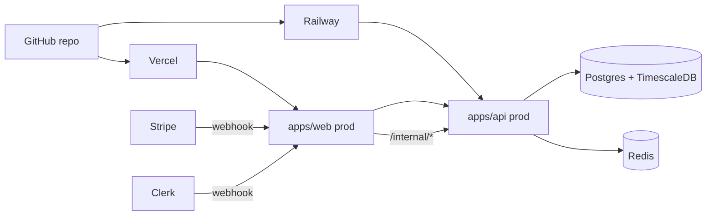

# SIGMA — Deployment Runbook

This is the manual-but-repeatable path to take SIGMA from `localhost` to a public,
billable production deployment. Pair this with [03_ENV_VARS.md](03_ENV_VARS.md) for
the full env-var reference and [06_ROADMAP.md](06_ROADMAP.md) for the launch
checklist.



## 1. Provision infrastructure

| Service | Provider (suggested) | Notes |
|---------|----------------------|-------|
| Web app | Vercel | Connect the GitHub repo, set the `apps/web` root directory |
| API | Railway | Dockerfile or Nixpacks, set the `apps/api` root directory |
| Postgres + TimescaleDB | Railway / Neon / Supabase | Must support the `timescaledb` extension |
| Redis | Railway / Upstash | TLS connection string |
| Auth | Clerk | Production instance, copy publishable + secret key |
| Billing | Stripe | Live mode products: Free, Pro ($49), Enterprise ($499) |
| Errors | Sentry | One project for `apps/web`, one for `apps/api` |

## 2. Configure environment variables

Copy values from [.env.example](.env.example), then set them in **both** Vercel and
Railway dashboards. Critical pairs:

- `INTERNAL_SECRET` must match between `apps/web` and `apps/api`. The Clerk and
  Stripe webhook handlers in `apps/web/app/api/webhooks/*` use it to call
  `apps/api/routers/internal.py`.
- `NEXT_PUBLIC_API_URL` (Vercel) must point at the public Railway URL of the API.
- `STRIPE_PRICE_PRO` and `STRIPE_PRICE_ENTERPRISE` must be the live-mode price IDs
  so [apps/web/app/api/webhooks/stripe/route.ts](apps/web/app/api/webhooks/stripe/route.ts)
  maps subscription events to the right plan.
- `NEXT_PUBLIC_GUMROAD_DASHBOARD_URL` and `NEXT_PUBLIC_GUMROAD_ML_URL` are optional;
  the landing page hides the Templates strip when blank.

## 3. Database migrations

After Railway provisions Postgres:

```bash
DATABASE_URL=postgresql+asyncpg://... \
  python -c "import asyncio; from db.connection import init_db; asyncio.run(init_db())"
```

Or apply the SQL files in [packages/db/migrations/](packages/db/migrations/) in
numeric order against the prod database. Run `001_initial_schema.sql`,
`002_timescaledb.sql`, `003_billing_events.sql`, `004_portfolio_snapshots.sql`.

## 4. Webhooks

| Source | URL to register | Secret env var |
|--------|------------------|----------------|
| Clerk  | `https://<web>/api/webhooks/clerk` | `CLERK_WEBHOOK_SECRET` |
| Stripe | `https://<web>/api/webhooks/stripe` | `STRIPE_WEBHOOK_SECRET` |

Register from the Clerk and Stripe dashboards after the web app is deployed and
reachable. Use `stripe trigger customer.subscription.created` locally first to
confirm the handler logic.

## 5. Deploy

- **Web:** push to `main`. Vercel builds and promotes automatically.
- **API:** push to `main`. Railway runs the build and rolls forward.
- Optional: add a [Vercel deploy hook](https://vercel.com/docs/deploy-hooks) to
  rebuild after content-only updates.

## 6. Verify

```bash
curl https://api.sigma.dev/health
curl -X POST https://api.sigma.dev/signals \
  -H "Authorization: Bearer sk_live_..." \
  -d '{"ticker":"AAPL"}'
```

Confirm in the Stripe dashboard that the meter `api_calls` increments. Confirm
in the Sentry dashboard that no errors fire for 24 hours after launch.

## 7. Load test (staging only)

```bash
pip install locust
SIGMA_LOADTEST_BASE_URL=https://staging-api.sigma.dev \
SIGMA_LOADTEST_API_KEY=sk_test_... \
make load-test
```

Open <http://localhost:8089>, dial up users until you see **~100 RPS sustained**.
Watch for:

- p95 latency over 3s on `POST /signals` &rarr; signal cache misses or DB pressure
- 429s before you hit the per-plan budget &rarr; Redis sliding-window misconfigured
- 500s &rarr; check Sentry; usually missing env var or DB pool exhausted

Never point the load test at production.

## 8. Custom domain + TLS

- Add `sigma.dev` and `api.sigma.dev` in Vercel/Railway dashboards.
- DNS: CNAME `sigma.dev` to Vercel, CNAME `api.sigma.dev` to Railway.
- SSL: both providers issue Let's Encrypt certs automatically.

## 9. Launch checklist (from 06_ROADMAP.md)

- [ ] `GET /health` returns 200 from prod
- [ ] `POST /signals` < 500ms cached / < 3s fresh
- [ ] `POST /portfolio/rebalance` < 5s
- [ ] Stripe usage meter increments per call
- [ ] Sign up &rarr; create key &rarr; call API &rarr; see usage in under 5 minutes
- [ ] Zero Sentry errors for 24h after launch
- [ ] Landing loads in &lt; 2s on Vercel edge (Lighthouse mobile)
