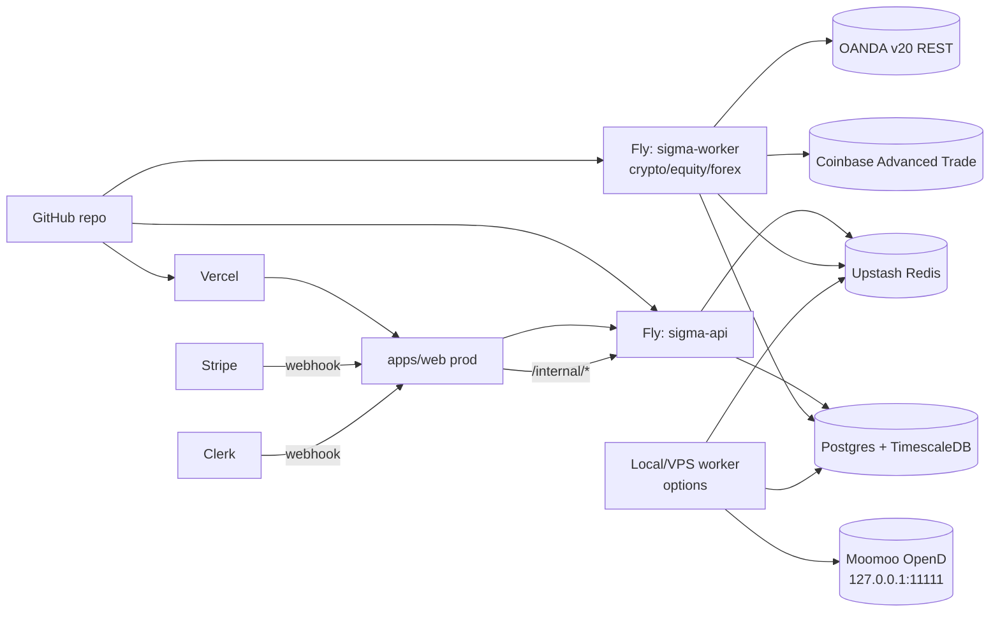

# SIGMA — Deployment Runbook

Manual-but-repeatable path from `localhost` to a public, billable production deployment. Pair this with [`03_ENV_VARS.md`](./03_ENV_VARS.md) for the full env-var reference and [`docs/ROADMAP.md`](./docs/ROADMAP.md) for the milestone + sprint plan.

**Per-asset-class overlays:** [docs/DEPLOY_EQUITY.md](docs/DEPLOY_EQUITY.md) (Alpaca paper) · [docs/DEPLOY_FOREX.md](docs/DEPLOY_FOREX.md) (OANDA, runs on Fly) · [docs/DEPLOY_OPTIONS.md](docs/DEPLOY_OPTIONS.md) (Moomoo — **local/VPS only**, OpenD can't run on Fly).



**Split topology:** crypto/equity/forex run on the Fly `sigma-worker` (all cloud APIs). Options run on a **separate local/VPS worker** next to a Moomoo OpenD gateway, sharing the same Postgres + Redis so it's one book. The global singleton lock + per-class heartbeats coordinate them; never run two workers covering the same asset class.

**Pause / resume (no redeploy):** halt one asset class with `POST /execution/pause {"asset_class":"forex"}` (internal-secret gated) and re-enable with `/execution/resume`. The worker checks the Redis flag each loop iteration; `/health/worker` reports `status:"paused"` for that class. Useful around high-impact events or to isolate a misbehaving venue. Full procedures: [`docs/RUNBOOK_WORKER.md`](./docs/RUNBOOK_WORKER.md).

## 1. Provision infrastructure

| Component | Provider (recommended) | Notes |
|---|---|---|
| Web app | Vercel | Connect the GitHub repo, set `apps/web` as root directory |
| API service | Fly.io | `apps/api/fly.toml`, app name `sigma-api`, primary region `ord` |
| Worker service | Fly.io | `apps/worker/fly.toml`, app name `sigma-worker`, **single instance only** |
| Postgres + TimescaleDB | Timescale Cloud (free 30 days) **or** Crunchy Bridge **or** self-hosted on a Fly machine | Migration `002_timescaledb.sql` calls `create_hypertable('candles', ...)`. Vanilla Postgres won't apply; pick a provider with the extension or skip the hypertable line for the alpha. |
| Redis | Upstash (Redis-compatible) | Fly sunset their managed Redis; Upstash free tier is the typical pair |
| Auth | Clerk | Production instance, copy publishable + secret key |
| Billing | Stripe | Live mode products: Free, Pro ($49), Enterprise ($499) |
| Errors | Sentry | One project for `apps/web`, one shared between `apps/api` + `apps/worker` |

## 2. One-time Fly setup

```bash
# Install the CLI
curl -L https://fly.io/install.sh | sh

# Authenticate
fly auth login

# API app
cd apps/api
fly launch --copy-config --no-deploy --org <your-org> --name sigma-api
cd ../..

# Worker app  (build context = repo root, fly.toml lives in apps/worker)
cd apps/worker
fly launch --copy-config --no-deploy --org <your-org> --name sigma-worker
cd ../..
```

`--copy-config` tells Fly to use the existing `fly.toml`; `--no-deploy` skips the first build until secrets are set.

## 3. Configure environment variables

Set every secret-bearing var via `fly secrets set`. Plain config (port numbers, mode flags) lives in `fly.toml` `[env]`.

```bash
# Shared between sigma-api and sigma-worker — same value on both apps
SHARED="\
  INTERNAL_SECRET=$(openssl rand -hex 32) \
  CLERK_SECRET_KEY=sk_live_... \
  STRIPE_SECRET_KEY=sk_live_... \
  STRIPE_WEBHOOK_SECRET=whsec_... \
  HUGGINGFACE_TOKEN=hf_... \
  SENTRY_DSN=https://... \
  LANGFUSE_PUBLIC_KEY=pk_lf_... \
  LANGFUSE_SECRET_KEY=sk_lf_..."

fly secrets set -a sigma-api    $SHARED
fly secrets set -a sigma-worker $SHARED

# Worker-only secrets
fly secrets set -a sigma-worker \
  COINBASE_API_KEY_NAME=organizations/... \
  COINBASE_PRIVATE_KEY="$(cat coinbase-private-key.pem)" \
  COINBASE_SANDBOX=true

# Database + Redis URLs (see step 4)
fly secrets set -a sigma-api    DATABASE_URL=... REDIS_URL=...
fly secrets set -a sigma-worker DATABASE_URL=... REDIS_URL=...
```

`INTERNAL_SECRET` must be identical across all three deployments (`apps/web` on Vercel, `sigma-api`, `sigma-worker`). The Clerk + Stripe webhook handlers in `apps/web/app/api/webhooks/*` use it to call `apps/api/routers/internal.py`, and `sigma-worker` uses it to call `/signals` without billing/rate-limit.

`NEXT_PUBLIC_API_URL` (Vercel) must point at the public Fly URL of the API (`https://sigma-api.fly.dev` or a custom domain — see step 9).

## 4. Postgres + Redis

### Postgres (Timescale-capable)

**Option A — Timescale Cloud** (easiest, free 30 days):

```bash
# Create at https://console.cloud.timescale.com
# Grab the asyncpg-compatible URL:
fly secrets set -a sigma-api    DATABASE_URL="postgresql+asyncpg://tsdbadmin:..."
fly secrets set -a sigma-worker DATABASE_URL="postgresql+asyncpg://tsdbadmin:..."
```

**Option B — Self-hosted Timescale on a Fly machine** (cheapest, more ops):

```bash
fly machine run timescale/timescaledb:latest-pg15 \
  --name sigma-pg \
  --org <your-org> \
  --region ord \
  --env POSTGRES_PASSWORD=$(openssl rand -hex 24)
# Then export the flycast hostname as DATABASE_URL
```

**Option C — Fly's managed Postgres** (no Timescale extension): edit migration `002_timescaledb.sql` to skip the `create_hypertable` call, or drop the file. Loses the hypertable optimization on `candles` but the alpha doesn't need it.

### Redis (Upstash)

Sign up at https://upstash.com → Create Database (Redis) → copy the `redis://` connection string. Set as `REDIS_URL` on both apps. Free tier covers 10k commands/day, more than enough for alpha.

## 5. Database migrations

After Postgres exists and `DATABASE_URL` is set:

```bash
# Pull the DATABASE_URL Fly stored as a secret
DATABASE_URL=$(fly ssh console -a sigma-api -C 'env | grep ^DATABASE_URL=' | cut -d= -f2-)

# Apply migrations from your local box (install psql if needed)
for f in packages/db/migrations/*.sql; do
  echo "applying $f"
  psql "$(echo "$DATABASE_URL" | sed 's/postgresql+asyncpg:/postgresql:/')" -v ON_ERROR_STOP=1 -f "$f"
done
```

Verify:

```sql
\d signal_history    -- asset_class column should be NOT NULL
\dt                  -- candles, positions, orders, exit_state present
select id, clerk_id from users where id = '00000000-0000-0000-0000-000000000001';
```

## 6. Webhooks

| Source | URL to register | Secret env var |
|---|---|---|
| Clerk  | `https://<web>/api/webhooks/clerk` | `CLERK_WEBHOOK_SECRET` |
| Stripe | `https://<web>/api/webhooks/stripe` | `STRIPE_WEBHOOK_SECRET` |

Register from each dashboard after Vercel and Fly are reachable. Use `stripe trigger customer.subscription.created` locally first to confirm the handler.

## 7. Deploy

```bash
# API
cd apps/api && fly deploy

# Worker (run from repo root so build context is correct)
fly deploy -a sigma-worker --config apps/worker/fly.toml --dockerfile apps/worker/Dockerfile .

# Web
cd apps/web && vercel --prod
```

GitHub Actions can deploy on push to `main` later; for the alpha, manual is fine.

## 8. Verify

```bash
# Public API health
curl https://sigma-api.fly.dev/health

# Authenticated signal
curl -X POST https://sigma-api.fly.dev/signals \
  -H "Authorization: Bearer sk_live_..." \
  -d '{"ticker":"AAPL"}'

# Worker tail — should show ticks every 5 minutes (crypto cadence)
fly logs -a sigma-worker

# Internal cycle trigger (from your laptop, with the shared INTERNAL_SECRET)
curl -X POST https://sigma-api.fly.dev/execution/run_cycle \
  -H "X-Internal-Secret: ..." \
  -d '{"asset_class":"crypto"}'
```

Stripe meter `api_calls` increments on customer-key requests but **not** on internal-secret requests. Confirm both in the Stripe + Sentry dashboards.

## 9. Custom domain + TLS

```bash
# API
fly certs create -a sigma-api api.sigma.dev
# DNS: CNAME api.sigma.dev → sigma-api.fly.dev

# Web — add sigma.dev in the Vercel dashboard → follow DNS instructions
```

Fly auto-issues Let's Encrypt certs once DNS resolves.

## 10. Load test (staging only)

```bash
pip install locust
SIGMA_LOADTEST_BASE_URL=https://staging-api.sigma.dev \
SIGMA_LOADTEST_API_KEY=sk_test_... \
make load-test
```

Open <http://localhost:8089>, dial up users until ~100 RPS sustained. Watch for:

- p95 latency > 3s on `POST /signals` → signal cache misses or DB pressure
- 429s before per-plan budget → Redis sliding-window misconfigured
- 500s → Sentry; usually missing env var or DB pool exhausted

Never point the load test at production.

## 11. Launch checklist (from docs/ROADMAP.md)

- [ ] `GET /health` returns 200 from prod
- [ ] `POST /signals` < 500ms cached / < 3s fresh
- [ ] `POST /portfolio/rebalance` < 5s
- [ ] Worker `fly logs` shows one healthy tick per cadence interval
- [ ] `select count(*) from orders where executor='paper'` > 0 after the first hour
- [ ] Stripe usage meter increments per customer-key call, **not** on internal-secret calls
- [ ] Sign up → create key → call API → see usage in under 5 minutes
- [ ] Zero Sentry errors for 24h after launch
- [ ] Landing loads in < 2s on Vercel edge (Lighthouse mobile)

## Why Fly over Railway

Fly was picked for the alpha for three reasons: Docker-first model that matches our existing `Dockerfile`s exactly; cheaper for always-on workers ($5–15/mo vs $15–25); finer regional control if EU customers come later. Railway, Render, and self-hosting on Hetzner are all viable swaps if Fly proves annoying — the only Fly-specific files are `apps/api/fly.toml` and `apps/worker/fly.toml`.
