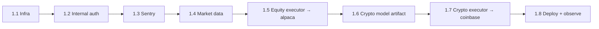

# SIGMA — M1 Bring-Up Checklist (continuous paper trades)

> The operational path to a single house book trading continuously in **paper**
> mode on Fly. No new schema — this is wiring the loop that already exists.
> Long-form steps live in [`../DEPLOY.md`](../DEPLOY.md) (crypto-first) and
> [`DEPLOY_EQUITY.md`](DEPLOY_EQUITY.md) (equity/Alpaca); this file is the
> sequenced checklist with acceptance gates. Tick each box only when its
> **Acceptance** command passes.



| Owner | Steps |
| --- | --- |
| **You** (accounts, secrets, deploy) | 1.1, 1.2, 1.3, 1.4, 1.5, 1.7, 1.8 |
| **Repo** (already wired in this branch) | 1.6 bundling (`.dockerignore` + `MODEL_DIR`) — you still run the training |

---

## 1.1 — Provision infra

- Create Postgres+TimescaleDB (Timescale Cloud / Crunchy Bridge) and Redis (Upstash).
- Set `DATABASE_URL` + `REDIS_URL` as **secrets** on both apps:

```bash
fly secrets set -a sigma-api    DATABASE_URL="postgresql+asyncpg://..." REDIS_URL="rediss://..."
fly secrets set -a sigma-worker DATABASE_URL="postgresql+asyncpg://..." REDIS_URL="rediss://..."
```

- Apply migrations (see [`DEPLOY.md` §5](../DEPLOY.md)):

```bash
for f in packages/db/migrations/*.sql; do
  psql "$(echo "$DATABASE_URL" | sed 's/postgresql+asyncpg:/postgresql:/')" -v ON_ERROR_STOP=1 -f "$f"
done
```

**Acceptance:** `\dt` lists `candles`, `positions`, `orders`, `exit_state`; `\d signal_history` shows `asset_class NOT NULL`.

- [x] **1.1 done** — *2026-06-10:* Timescale Cloud + Upstash provisioned; `DATABASE_URL`/`REDIS_URL` verified reachable; migrations **001–013** applied to the cloud Postgres and verified (`trading_accounts` + house account row, `account_id` on positions/orders/exit_state, composite idempotency index). `fly secrets set` for both URLs still pending (needs `fly auth login`).

---

## 1.2 — Service auth (worker → API)

```bash
SECRET=$(openssl rand -hex 32)
fly secrets set -a sigma-api    INTERNAL_SECRET="$SECRET"
fly secrets set -a sigma-worker INTERNAL_SECRET="$SECRET"   # must be identical
```

**Acceptance:** after deploy, a worker `/signals` call returns 200 and is logged internal/unbilled:

```sql
select internal, count(*) from usage_logs where created_at > now() - interval '1 hour' group by 1;
-- internal=true rows present; Stripe meter does NOT increment for them
```

- [ ] **1.2 done**

---

## 1.3 — Observability

```bash
fly secrets set -a sigma-worker SENTRY_DSN="https://...@sentry.io/..."
```

Without this the worker fails silently (see `apps/worker/main.py::_init_sentry`).

**Acceptance:** a forced tick exception appears in the Sentry project (e.g. temporarily point `DATABASE_URL` at an unreachable host, confirm the captured event, then restore).

- [ ] **1.3 done**

---

## 1.4 — Market-data credentials

Equity data uses the fallback chain **Tiingo → Alpaca → yfinance**. Crypto data
is Coinbase public candles (no key needed for data).

```bash
fly secrets set -a sigma-worker TIINGO_API_KEY="..." ALPACA_API_KEY="..." ALPACA_SECRET="..."
fly secrets set -a sigma-api    TIINGO_API_KEY="..." ALPACA_API_KEY="..." ALPACA_SECRET="..."
```

**Acceptance:** worker log shows `[equity-data] tiingo served AAPL ...` (not a yfinance last-resort line) during a tick.

- [ ] **1.4 done**

---

## 1.5 — Flip the equity executor off paper

In `apps/worker/fly.toml` `[env]` (commit) + secrets:

```toml
WORKER_ASSET_CLASSES = "equity"     # or "crypto,equity"
EQUITY_EXECUTOR      = "alpaca"     # was "paper"
ALPACA_PAPER         = "true"       # live needs ALPACA_ALLOW_LIVE=true (out of scope for M1)
```

**Acceptance (during US RTH 09:30–16:00 ET):**

```sql
select count(*) from orders where executor='alpaca' and asset_class='equity';  -- grows
```

…and the same fills appear in the Alpaca paper dashboard.

- [ ] **1.5 done** — config side complete: `apps/worker/fly.toml` already ships `WORKER_ASSET_CLASSES="equity"`, `EQUITY_EXECUTOR="alpaca"`, `ALPACA_PAPER="true"`, `EQUITY_DATA_PROVIDERS="alpaca,tiingo"`. Remaining: set Alpaca secrets on Fly + verify orders during RTH.

---

## 1.6 — Crypto model artifact  *(bundling already wired in this branch)*

Train and bundle the RankingModel. The `.dockerignore` now re-includes
`crypto_ranking_v1.0.pkl` and `MODEL_DIR` is already `/app/api/ml/saved_models`
in `apps/worker/fly.toml` — you only need to produce the artifact and commit it.

```bash
make train-ranking                 # → apps/api/ml/saved_models/crypto_ranking_v1.0.pkl
git add apps/api/ml/saved_models/crypto_ranking_v1.0.pkl
```

**Acceptance:**

```bash
cd apps/api && PYTHONPATH=. python -c "
from ml.models.registry import resolve, clear_cache
clear_cache(); m = resolve('crypto'); print(type(m).__name__)"
# prints the RankingModel class, NOT a heuristic / None
```

- [x] **1.6 done** — *2026-06-10:* `crypto_ranking_v1.0.pkl` trained + committed; `crypto_meta_v1.0.pkl` (n=1037, win_rate 0.528) image-baked too (Fly machines have no durable volume, so out-of-band copies don't survive restarts). Both dormant until crypto joins `WORKER_ASSET_CLASSES`. NOTE: the **equity** ensemble was REFUSED by the train gate (val 0.348 < majority 0.377) and pulled — equity trades the technical-only blend.

---

## 1.7 — Flip the crypto executor (sandbox first)

```toml
CRYPTO_EXECUTOR = "coinbase"   # was "paper"
COINBASE_SANDBOX = "true"
```

```bash
fly secrets set -a sigma-worker COINBASE_API_KEY_NAME="organizations/..." \
  COINBASE_PRIVATE_KEY="$(cat coinbase-private-key.pem)"
```

**Acceptance:** crypto orders land in `orders` with `executor='coinbase'`; a full sandbox order roundtrip (place → fill → persisted) is captured.

- [ ] **1.7 done**

---

## 1.8 — Deploy + observe

```bash
cd apps/api && fly deploy && cd ../..
fly deploy -a sigma-worker --config apps/worker/fly.toml --dockerfile apps/worker/Dockerfile .
```

**Acceptance:**

```bash
curl https://sigma-api.fly.dev/health/worker   # "ok"
fly logs -a sigma-worker                        # one healthy tick per WORKER_TICK_SECONDS_*
```

- [ ] one healthy tick per cadence interval
- [ ] `/health/worker` = `ok` during market hours
- [ ] **2+ weeks unattended** (M1 success criterion)

---

## Hardening blockers (work, not config — do after trades are flowing)

These are real code tasks, not env wiring. Tracked in [`ROADMAP.md`](ROADMAP.md)
Sprints 2–3.

| Item | Why it blocks "reliable" continuous ops | Sprint |
| --- | --- | --- |
| **Startup position reconciliation** | A worker restart mid-trade must resume from a consistent persisted book, or it can lose trailing-stop bookkeeping / leave flat-but-open rows | 2 |
| **Partial-fill reconciliation** | Compare `orders` to broker fills; tighten `_apply_fill_to_position` so partial fills don't drift position qty/avg-px from the broker's truth | 3 |

- [x] **startup reconciliation implemented** — `apps/worker/reconcile.py`, called from `main.py` after the singleton lock. Heals missing `exit_state` rows + flat-but-open positions; opt-in broker cross-check (`get_broker_positions`) surfaces DB-vs-broker divergences. Tests in `apps/api/tests/test_worker_reconcile.py` (run in WSL: `cd apps/api && PYTHONPATH=. pytest tests/test_worker_reconcile.py -q`).
- [x] **partial-fill reconciliation implemented** — `apps/worker/fill_reconcile.py`, runs at the start of every tick before the book loads. Diffs recent non-terminal `orders` rows against the broker's cumulative fill (`executor.get_order_status`, opt-in hook — implemented for Alpaca) and applies the delta tranche at the implied price so DB avg-px converges exactly to the broker's. Broker-under-DB is surfaced as a divergence, never auto-shrunk. The Alpaca executor also implements `get_broker_positions()`, activating the startup reconciler's broker cross-check. Tests in `apps/api/tests/test_fill_reconcile.py`.
