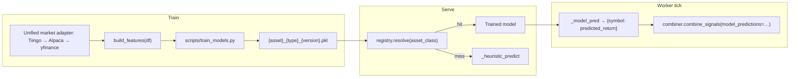

# SIGMA — Models, Features & Training

How signals are produced, how models are trained and resolved, and how the
worker uses them. Reflects the equity-alpha state (post tradeFlux merge).

---

## Lifecycle at a Glance



**Resolution order:** equity → `ensemble` → `lstm` → `quantum_hybrid`; crypto → `ranking` → `ensemble`. Trained registry models **always** consume `build_features(df)` — never `FeatureEngineer` output.

---

## Two feature builders — don't mix them

| Builder | File | Columns | Used by | Roadmap |
|---|---|---|---|---|
| `build_features` | `ml/features.py` | `rsi_14, roc_10, ema_20, ema_50, ema_ratio, bb_width, atr_14, volume_ratio, ret_1d, ret_5d` | **Trained models** (ensemble/LSTM/quantum), `ml/pipeline.py`, heuristic fallback | Unified feature store (backlog) |
| `FeatureEngineer.compute` | `ml/sequences.py` | `rsi, atr, ema_fast, ema_slow, mom_1/3/12, vol_realized, rolling_vol_50, v_spike, breakout_20, …` | **RankingModel** (crypto), **technical strategy combiner** (momentum, ICT, SDE, …) | Converge on shared column registry |

The two column sets are **disjoint**. A model trained on `build_features` will
`KeyError` if fed `FeatureEngineer` output. This bit us once (see "Worker model
wiring"); the rule is: **trained registry models always consume
`build_features(df)`**.

## Registry — resolution & artifact naming

`ml/models/registry.py::resolve(asset_class)` returns the first model that loads,
else `None` (callers fall back to `_heuristic_predict`).

Load order:
- **equity** → `ensemble` → `lstm` → `quantum_hybrid`
- **crypto** → `ranking` → `ensemble`

Artifact path: `{MODEL_DIR}/{asset_class}_{model_type}_{version}.{pkl|pt}`, with a
legacy fallback `{MODEL_DIR}/{model_type}_{version}.{ext}`. `MODEL_DIR` defaults
to `./ml/saved_models`; `version` defaults to `settings.model_version` (`v1.0`).

> **No equity model currently ships.** The legacy `ensemble_v1.0.pkl` was pulled
> on 2026-06-10 after the train gate (`ml/train_gate.py`) measured it edgeless —
> val_accuracy 0.348 vs majority baseline 0.377 with train_accuracy 0.90 (pure
> overfit). The registry resolves equity → None and the worker trades the
> technical-only blend. A replacement ships as `equity_ensemble_{version}.pkl`
> only when `train_models.py --ensemble` passes the gate.

## Training

Data for all equity training flows through the unified adapter
(`markets.equity` → Alpaca → Tiingo), so **training and serving use
identical bars**.

```bash
cd apps/api
# Equity ensemble (RandomForest + XGBoost soft-vote) on daily bars:
PYTHONPATH=. python scripts/train_models.py --ensemble       # -> ensemble_v1.0.pkl
#   --lstm / --quantum-hybrid / --all  also available (slower)

# Crypto RankingModel (LightGBM) on Coinbase 5m candles:
PYTHONPATH=. python scripts/train_ranking.py                 # -> crypto_ranking_v1.0.pkl
```

`scripts/train_models.py` labels next-day return at ±0.5% into BUY/HOLD/SELL and
trains on `DEFAULT_TICKERS` (AAPL, MSFT, GOOG, AMZN, META, NVDA, TSLA, JPM, V,
WMT). Override with `--tickers ...` / `--version ...`.

### Verify a freshly trained artifact
```bash
PYTHONPATH=. python -c "
from ml.models.registry import resolve, clear_cache
clear_cache(); m = resolve('equity'); print(type(m).__name__, m.feature_names)"
```

## Worker model wiring

Each tick (`apps/worker/tick.py`):
1. `model = _resolve_model(asset_class)` — once per tick (registry is cached).
2. Per symbol, `_model_pred(model, symbol, df)` builds `build_features(df)` and
   calls `model.predict(...)`, returning `{symbol: predicted_return}` (or `{}`
   when no model / empty data — clean technical-only fallback).
3. That dict is passed to `combiner.combine_signals(..., model_predictions=...)`
   so `MLStrategy` contributes the trained signal alongside the technical
   strategies.

## Shipping the model to production

The worker image bundles the artifact: `.dockerignore` excludes
`ml/saved_models/*.pkl` **except** `!apps/api/ml/saved_models/ensemble_v1.0.pkl`.
Because the worker image copies `apps/api` to `/app/api` (CMD runs from `/app`),
`apps/worker/fly.toml` sets `MODEL_DIR=/app/api/ml/saved_models` so the registry
finds it. (The API image copies `apps/api` to `/app`, so its default
`./ml/saved_models` is already correct.)

~3 MB binary in git is acceptable for the alpha; move to object storage if the
retrain cadence grows (see roadmap backlog).

## Retrain cadence (alpha guidance)

- Equity ensemble: retrain weekly or when rank-quality visibly drifts; commit the
  new `ensemble_v1.0.pkl` and redeploy the worker.
- Keep `version` bumps (`v1.1`, …) for breaking feature changes; the alpha
  overwrites `v1.0` in place for routine retrains.
- **Weekly strategy review:** after labeled outcomes accumulate, pull
  `GET /strategies/performance/report?period=7d` (or open `/strategies`) and paste
  the markdown `summary` into the sprint retro in `docs/ROADMAP.md`.
- Open backlog: Optuna hyperparameter search, rank-IC regression gate in CI,
  online/incremental refit, object-storage delivery instead of image-baked,
  unified feature store (`build_features` ↔ `FeatureEngineer`).

## MLflow experiment names

Training runs log to per-family MLflow experiments (see `ml/experiment.py`):

| asset_class | model_type | experiment |
|---|---|---|
| equity | ensemble | `sigma-equity-ensemble` |
| equity | lstm | `sigma-equity-lstm` |
| equity | quantum_hybrid | `sigma-equity-quantum-hybrid` |
| crypto | ranking | `sigma-crypto-ranking` |
| crypto | ensemble | `sigma-crypto-ensemble` |
| forex | ensemble | `sigma-forex-ensemble` |

`start_run(..., tags={"asset_class": "...", "model_type": "..."})` selects the
experiment automatically. Override the tracking URI with `MLFLOW_TRACKING_URI`; the
legacy `MLFLOW_EXPERIMENT` setting is the fallback when tags are absent.

## Signal embeddings (pgvector)

Migration `012_pgvector_embeddings.sql` adds `signal_embeddings` for similarity
search over labeled signals. Embed labeled rows:

```bash
make migrate   # applies 012 (requires pgvector extension on Postgres)
cd apps/api && PYTHONPATH=. python scripts/embed_signals.py --asset-class equity
```

Enable the nightly scheduler job with `EMBED_SIGNALS_ENABLED=true` (default off).

## Audit records & strategy reports

Migration `009_decision_logging.sql` created `audit_records`; equity/crypto/forex
ticks (`apps/worker/tick.py`) build an in-memory `AuditLog` per cycle and persist
every symbol evaluation via `db.audit_store.persist_audit_log`. Each row captures
data/features/signal JSON, gate chain (e.g. `G2_signal` with reasons like
`HOLD signal`), and final decision (`placed`, `skipped`, `rejected`). Options
ticks use the same store (`apps/worker/options_tick.py`).

Query examples: [`docs/E2E_VALIDATION.md`](E2E_VALIDATION.md) § Audit & strategy reports.

**Weekly strategy review** — aggregate labeled `signal_history` by component
strategy (`ml/strategy_performance.py`):

```bash
curl -s "http://localhost:8001/strategies/performance/report?asset_class=equity&period=7d" \
  -H "Authorization: Bearer <api-key>" | jq
```

Response includes per-strategy win rates above a strength threshold plus a
markdown `summary` field suitable for paste into a weekly retro. Use
`/strategies/performance?period=7d` for the same stats without forcing the
report defaults. Dashboard: `/strategies` (Next.js; equity + 7d default).

## Model promotion reports

When the self-evolving loop proposes a new artifact (`model_promotions` row),
compare candidate vs incumbent before approve/reject:

```bash
curl -s "http://localhost:8001/models/promotions/<promotion-id>/report" \
  -H "Authorization: Bearer <api-key>" | jq '.summary, .comparison, .recommendation'
```

Returns structured JSON: incumbent/candidate `ModelEvaluation` snapshots, metric
deltas, `recommendation` (`candidate_leads`, `review`, …), and markdown
`summary`. Approve/reject remain internal-only (`X-Internal-Secret` or internal auth).

## Strategy comparison CLI

Compare strategies across a ticker universe without placing orders:

```bash
cd apps/api
PYTHONPATH=. python scripts/compare_universe_strategies.py --asset-class equity --strategies momentum,ict,ml
```

**Emerging Tech 16 (report-only):** pass all 16 PDF tickers via `--symbols` (see
[`docs/universes/EMERGING_TECH_16.md`](universes/EMERGING_TECH_16.md) and the
example in [`EMERGING_TECH_WORK_PLAN.md`](universes/EMERGING_TECH_WORK_PLAN.md)).
Does not load ensemble predictions today (`model_predictions={}` in the script).
Live worker universe remains `EQUITY_UNIVERSE` mega-caps until the work plan
live-trading section is complete.
