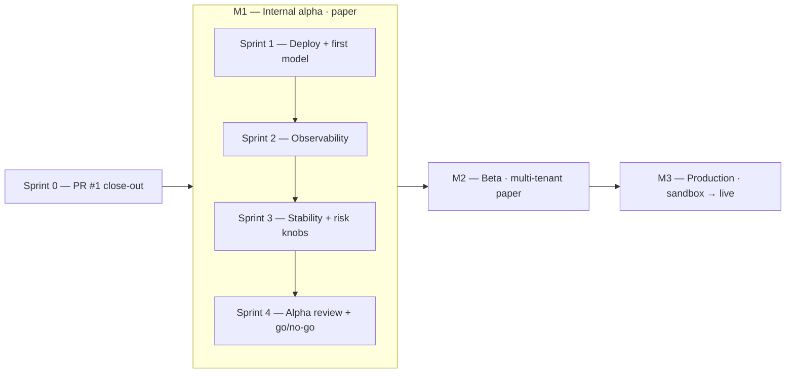

# SIGMA Roadmap

Working doc for what's coming next. Single-source-of-truth for milestones, sprints, and backlog. Updated as scope shifts — don't treat dates as commitments.

**Operating mode:** solo, side-project, ~20h per 2-week sprint. Scope is deliberately small per sprint so things actually finish.

**Next milestone:** M1 internal alpha — Fly deploy + 2+ weeks paper observation (see Current status below).

> ## Current status (2026-06)
>
> **Milestone:** M1 internal alpha (paper), **equity-first** on Fly. Core build plus
> the **audit & reporting slice** (2026-06) are shipped on `main`:
> - 3-repo merge (razorBill + sigma + tradeFlux); per-asset combiner; trained **equity ensemble** in worker image
> - Reliable equity data: **Alpaca → Tiingo** (yfinance removed from training/serving path)
> - **Audit parity:** equity/crypto/forex ticks persist `audit_records` (same `AuditLog` shape as options)
> - **Strategy reporting:** `GET /strategies/performance`, `GET /strategies/performance/report?period=7d`, `/strategies` dashboard
> - **ML ops:** per-family MLflow experiments (`sigma-equity-ensemble`, …); `GET /models/promotions/{id}/report`
> - **pgvector MVP:** migration `012`, `scripts/embed_signals.py`, scheduler flag `EMBED_SIGNALS_ENABLED`
> - **Research CLI:** `scripts/compare_universe_strategies.py`
> - Worker Sentry; `/health/worker`; `executor.place()` retry/backoff; Redis singleton lock
> - **Next.js 16** web app; SQL migrations **001–012**
> - Deploy target **Fly.io** — [`DEPLOY_EQUITY.md`](DEPLOY_EQUITY.md), [`MODELS.md`](MODELS.md)
>
> **Next up (M1 operational — no new feature scope until observed):**
> 1. Fly deploy + apply migrations **001–012** on prod Postgres
> 2. **2+ consecutive weeks** paper (equity) without manual intervention
> 3. **Weekly strategy review** — `/strategies` or `GET .../performance/report?period=7d`
> 4. pgvector embed job on DGX/Timescale when ready (`EMBED_SIGNALS_ENABLED=true`)
> 5. M1 → M2 go/no-go after the observation window
>
> **Parallel track (research, not live universe):** [Emerging Tech 16](universes/EMERGING_TECH_16.md) —
> report/compare-first on high-beta names; live worker stays mega-cap until
> [work plan](universes/EMERGING_TECH_WORK_PLAN.md) live-trading items ship.

---

## Milestone Map

| Milestone | Posture | Gate to next |
| --- | --- | --- |
| M1 — Internal alpha | House book, paper, Fly.io | 2+ weeks unattended + trained ensemble live |
| M2 — Beta | Multi-tenant, paper, crypto exposed | 4 weeks clean metered traffic |
| M3 — Production | Sandbox → live, capped notional | DR runbook + 2-week order roundtrip |

---

## Milestones

### M1 — Internal alpha (paper) · target: 8 weeks from PR #1 merge

Success criteria:
- Worker runs on **Fly.io** for 2+ consecutive weeks without manual intervention
- ~~Trained equity ensemble in production~~ **revised 2026-06-10:** the train gate measured the equity ensemble edgeless (val 0.348 < majority 0.377; train 0.90 = overfit) and the artifact was pulled — equity runs the **technical-only blend** for the observation window. Crypto runs the trained `crypto_ranking_v1.0.pkl`. A new equity model ships only by passing the gate.
- Daily signal log + **weekly strategy review** habit established (`/strategies` or performance report API)
- **Audit trail** queryable per tick (`audit_records` for equity/crypto/forex/options)
- Sentry shows ≤1 unique exception per week (worker Sentry wired)
- A go/no-go decision on M2 is informed by real observed behavior

### M2 — Beta (paper, multi-tenant) · target: after M1 + 4 weeks observation

Success criteria:
- `/signals?asset_class=crypto` exposed to Pro+ customers
- Stripe metering correct (no internal traffic billed; no crypto calls free)
- Public web pages for crypto signals (Clerk-authed, no plaintext key boxes)
- API reference docs for positions/orders/execution endpoints
- 1+ external user trying it without paid handholding

### M3 — Production (sandbox → live) · target: when M2 has 4+ weeks of clean traffic

Success criteria:
- `CRYPTO_EXECUTOR=coinbase` with sandbox keys, full order roundtrip captured in `orders` table for 2 weeks
- Switch to live keys with a hard cap on per-day notional
- DR runbook (`DEPLOY.md` updated): how to stop the worker, reconcile open positions, restart
- Real-money trading on the house book, no customer-facing live execution

---

## Active sprint — Sprint 0 (PR #1 close-out)

**Goal:** get PR #1 reviewed and merged. No new feature scope.

Working items (each is a checkbox; closing all of them ends the sprint):

- [ ] **Decide WIP commit `81ee40b`** — squash into merge commit, split into a separate PR, or `git reset` and re-stage in pieces. (Reviewer-facing decision; affects history clarity.)
- [ ] **Self-review the diff** — skim 18 commits with fresh eyes against [PR #1](https://github.com/Quantum-Global-Group/sigma/pull/1).
- [ ] **Resolve `06_ROADMAP.md` conflict** — currently dirty on `feat/razorbill-merge`. Either fold into this `docs/ROADMAP.md` or rebase.
- [ ] **Add `gh pr edit 1 --add-reviewer @user`** if someone external is reviewing; otherwise self-merge.
- [ ] **CI green** — GitHub Actions doesn't exist yet on sigma. Decide: add minimal pytest workflow now, or merge without CI and add it M1 Sprint 1.
- [ ] **Merge to `main`** (squash or rebase — pick once, document choice). **Decision:** squash — [`docs/decisions/001-squash-vs-rebase.md`](decisions/001-squash-vs-rebase.md).
- [ ] **Archive `iconbaypark2900/razorBill`** on GitHub (Settings → Archive). One click.
- [ ] **Delete `feat/razorbill-merge`** locally + remote after merge.

Cleanup that's already done:
- [x] razorBill local branch `claude/tender-curie-ebee21` deleted (worktree directory leftover; cleans up on session end)
- [x] Migrations 001–012 applied + schema verified locally (postgres + timescaledb; includes `audit_records`, pgvector `012`)
- [x] pytest: 100/100 green (commit `33ee859`)
- [x] Dockerfile bumps to `python:3.12-slim` + `.dockerignore` committed (commit `f955541`)
- [x] `docker-compose.override.yml` added to `.gitignore` (local-only port-conflict workaround stays out of git)

---

## M1 — Internal alpha

### Shipped slice — audit & reporting (2026-06)

Code landed; operational validation still pending (Fly deploy + observation window):

- [x] **Audit parity** — `apps/worker/tick.py` persists full `AuditLog` to `audit_records` for equity/crypto/forex (options already via `options_tick.py`; migration `009`)
- [x] **Strategy performance API** — `GET /strategies/performance` (+ `period`, `asset_class`); weekly `GET /strategies/performance/report?period=7d` with markdown `summary`
- [x] **`/strategies` dashboard** — Next.js page + sidebar nav; defaults equity + 7d
- [x] **MLflow experiment names** — per family in `ml/experiment.py` (`sigma-equity-ensemble`, …)
- [x] **Promotion comparison report** — `GET /models/promotions/{id}/report` (candidate vs incumbent metrics + markdown)
- [x] **pgvector embeddings MVP** — migration `012_pgvector_embeddings.sql`, `scripts/embed_signals.py`, scheduler `EMBED_SIGNALS_ENABLED`
- [x] **Universe strategy CLI** — `scripts/compare_universe_strategies.py`
- [x] **Equity data path** — Alpaca → Tiingo unified adapter; yfinance removed from `ml/data.py`
- [x] **Next.js 16** — `apps/web` upgraded (React 19)

### Sprint 1 — Deploy + first model train (2 weeks)

> **Emerging Tech 16:** parallel **reporting/research** universe (PDF-aligned); does not
> change `EQUITY_UNIVERSE` during M1 observation. Track gaps in
> [`docs/universes/EMERGING_TECH_WORK_PLAN.md`](universes/EMERGING_TECH_WORK_PLAN.md).

> **Status: In progress (begun 2026-06).** Code path is **equity-ready**; operational
> deploy + observation window not started; `flyctl` auth is available on this machine,
> owned Fly apps are provisioned, and prod DB/Redis/broker secrets are still pending. Fly configs live in `apps/{api,worker}/fly.toml`; equity **ensemble**
> artifact (`ensemble_v1.0.pkl`, 3.2 MB) loads via registry legacy path; worker image
> whitelists it in `.dockerignore` with `MODEL_DIR=/app/api/ml/saved_models`.
> Worker Sentry + `/health/worker` shipped. **Follow
> [`DEPLOY_EQUITY.md`](DEPLOY_EQUITY.md)** for the equity runbook; copy-paste checklist
> in [`SPRINT1_DEPLOY_CHECKLIST.md`](SPRINT1_DEPLOY_CHECKLIST.md).
>
> The table below is the **original crypto-first plan** (historical reference). For M1,
> use the equity equivalents in DEPLOY_EQUITY / the execution checklist.

#### Code-complete (verified 2026-06-01)

- [x] Fly configs — `apps/api/fly.toml`, `apps/worker/fly.toml` (region `ord`, health check, single VM)
- [x] Worker `MODEL_DIR` fix — points at `/app/api/ml/saved_models` in worker image
- [x] Ensemble artifact — `apps/api/ml/saved_models/ensemble_v1.0.pkl`; registry loads `EnsembleSignalModel`
- [x] Bundle artifact in worker image — `.dockerignore` re-includes `ensemble_v1.0.pkl`
- [x] Worker Sentry + `/health/worker` endpoint
- [x] Migrations 001–012 apply cleanly (local TimescaleDB + pgvector `012`)
- [x] Deploy-related pytest subset — 51/51 green (verified 2026-06-02)

#### Operational (pending — DGX / operator)

- [x] Install `flyctl` + `fly auth login` (DGX 2026-06-01; `jonaston015@gmail.com`)
- [x] Provision Fly apps — owned apps `sigma-api-proud-tree-92`, `sigma-worker-proud-tree-92` (2026-06-02)
- [ ] Provision Timescale Cloud Postgres + Upstash Redis
- [ ] Set production secrets on both apps (see DEPLOY_EQUITY §4 + `.env.example`)
- [x] Commit equity worker env in `apps/worker/fly.toml` — `2497aba` (2026-06-02)
- [ ] Run migrations 001–012 against prod Postgres
- [ ] `fly deploy` both apps
- [ ] Worker tail green during US RTH; orders row growth in Postgres + Alpaca paper dashboard
- [ ] Sprint 1 retro paragraph (honest velocity note)

#### Sprint 1 execution checklist

Run on the operator machine (DGX) with network + secrets. Full detail:
[`SPRINT1_DEPLOY_CHECKLIST.md`](SPRINT1_DEPLOY_CHECKLIST.md).

1. **Local sanity** — `cd apps/api && .venv/bin/python -c "from ml.models.registry import resolve; print(resolve('equity'))"`
2. **Install Fly CLI** — `curl -L https://fly.io/install.sh | sh && fly auth login`
3. **Equity worker env** — edit `apps/worker/fly.toml` per DEPLOY_EQUITY §1; commit
4. **Provision apps** — `fly launch --copy-config --no-deploy` in `apps/api` and `apps/worker`
5. **Postgres + Redis** — Timescale Cloud + Upstash; copy connection strings
6. **Secrets** — `fly secrets set` shared + Alpaca/Tiingo on both apps (DEPLOY_EQUITY §4)
7. **Migrations** — apply `packages/db/migrations/001`–`012` to prod (DEPLOY_EQUITY §5)
8. **Deploy** — `cd apps/api && fly deploy`; then `fly deploy -a sigma-worker --config apps/worker/fly.toml --dockerfile apps/worker/Dockerfile .` from repo root
9. **Verify** — `curl …/health`, `curl …/health/worker`, `fly logs -a sigma-worker` during RTH
10. **Observe** — 2+ weeks paper; weekly `/strategies` review (hands off to Sprint 2 cadence)

*(Optional fresh train — skipped when no Tiingo/Alpaca keys:)*
`cd apps/api && PYTHONPATH=. python scripts/train_models.py --ensemble --asset-class equity`

| # | Task (crypto-first, historical) | Equity equivalent | Est |
|---|---|---|---|
| 1 | Provision Fly.io apps | DEPLOY_EQUITY §2 | 2h |
| 2 | Provision Postgres + Redis | DEPLOY_EQUITY §3 | 1h |
| 3 | Set production secrets | DEPLOY_EQUITY §4 | 1h |
| 4 | Run migrations 001–012 | DEPLOY_EQUITY §5 | 1h |
| 5 | `make train-ranking` (crypto) | ensemble train (done; re-run optional) | 3h |
| 6 | Bundle trained artifact | **done** — `.dockerignore` + `MODEL_DIR` | 2h |
| 7 | `fly deploy` both apps | DEPLOY_EQUITY §6 | 1h |
| 8 | Worker tail green | DEPLOY_EQUITY §7 | 2h |
| 9 | Sentry on worker | **done** | 2h |
| 10 | Sprint 1 retro | pending | 0.5h |

Sprint capacity: ~16h. Buffer: 4h.

> The CI workflow that was originally listed as Sprint 1 work (`.github/workflows/ci.yml`) shipped in Sprint 0 as part of PR #3. Pytest + npm type-check run on every push and PR against `main`.

### Sprint 2 — Observability + review cadence (2 weeks)

> **Partial delivery:** `/health/worker`, worker Sentry, strategy performance API +
> `/strategies` dashboard, and retrain/review guidance in `docs/MODELS.md` shipped
> ahead of schedule (2026-06 slice). Remaining: Langfuse spans, daily digest, position reconcile on startup.

| # | Task | Notes | Est |
|---|---|---|---|
| 1 | Langfuse spans inside `worker.tick.tick_once` | Per-symbol child span; visibility into combiner score breakdown | 4h |
| 2 | ~~`apps/api/routers/health.py::/health/worker`~~ | **done** — heartbeat-derived liveness | 2h |
| 3 | Daily digest cron — orders + signal_history summary | Email or Slack webhook (not Railway-specific) | 4h |
| 4 | Position reconciliation on worker startup | Sanity-check open positions vs broker (paper: just self-consistent) | 3h |
| 5 | ~~Retrain + review cadence doc~~ | **done** — `docs/MODELS.md` (retrain cadence + weekly strategy report) | 2h |
| 6 | Sprint 2 retro | | 0.5h |

### Sprint 3 — Stability + risk knobs (2 weeks)

Carries the still-open PR #1 risks plus alpha learnings.

| # | Task | Notes | Est |
|---|---|---|---|
| 1 | Plumb `use_atr_trailing` + `use_partial_profits` through config | Currently default-off via function defaults — make explicit `Settings` fields | 2h |
| 2 | Partial-fill broker-view reconciliation | Compare orders table to Coinbase fills (paper: still useful for testing the reconciler) | 4h |
| 3 | ~~Retry + circuit-breaker on `executor.place()` failures~~ | **done** — bounded retry with exponential backoff | 3h |
| 4 | Coinbase public-API rate limit handling | The current `time.sleep(0.1)` in `_fetch_paginated` is a courtesy, not a budget | 2h |
| 5 | Worker graceful shutdown test | SIGTERM mid-tick should complete current symbol then exit | 2h |
| 6 | Sprint 3 retro | | 0.5h |

### Sprint 4 — Alpha review + M1 → M2 decision (2 weeks)

| # | Task | Notes | Est |
|---|---|---|---|
| 1 | 2 weeks of observation, weekly retros | Trade log review, signal-quality sanity check | 4h |
| 2 | Decision doc: extend alpha, move to M2, or pivot | Written rationale committed to `docs/decisions/001-alpha-outcome.md` | 2h |
| 3 | Backfill any tech-debt items the alpha surfaced | Pull from backlog | 8h |
| 4 | Update M2 sprint plan based on what we learned | Edit this file | 1h |

---

## M2 — Beta (paper, multi-tenant)

High-level outline; sprints get planned after M1 closes.

- Stripe metering correctness audit — distinguish `asset_class=crypto` calls from equity in usage_logs
- Pricing decision — fold crypto signals into Pro, or new "Crypto" tier? Stripe price IDs, plan upgrade flow
- Web pages — remove plaintext API key input on positions/orders/execution; integrate Clerk session
- ~~API reference docs for new endpoints~~ — **done** (M1 slice): [`05_API_REFERENCE.md`](../05_API_REFERENCE.md) + [`docs/05_API_REFERENCE.md`](05_API_REFERENCE.md)
- Rate-limit fairness across asset classes
- Customer-facing changelog
- Beta-user invite flow

---

## M3 — Production (sandbox → live)

Outline — needs M2 learnings to refine.

- Coinbase Advanced Trade sandbox keys provisioned + tested for 2 weeks
- Per-day notional cap enforcement (server-side, not just config)
- Risk circuit breaker — single switch to halt all worker buys
- `DEPLOY.md` updated with: rollback strategy, position reconcile under stress, on-call rotation
- Multi-region postgres consideration
- Disaster recovery dry-run

---

## Backlog

Unsorted, untimed. Items move into a sprint when they earn it. Tagged by area for grep.

### Trading core

- ~~**MT5 / BlackBull bridge MVP**~~ — **done**: EvoX2 bridge service, DGX `Mt5BridgeAdapter`/`Mt5BridgeExecutor`, per-symbol forex routing, `/health/worker` bridge status, verification script, [`docs/DEPLOY_MT5.md`](DEPLOY_MT5.md)
- **Per-symbol RankingModel option** — registry tries `crypto_ranking_{symbol}_v.pkl` first, falls back to shared
- **Backtest endpoint extended for crypto** — `/backtest/run` currently equity-only via Alpaca/Tiingo; needs crypto-aware data source
- **Multi-timeframe filter wired in** — `apps/api/ml/multi_timeframe.py` ported but unused by the combiner
- **`load_exit_state` / `save_exit_state` stub cleanup** — risk/exits.py still has the no-op stubs; remove once nothing imports them
- **Per-asset-class worker tick cadence override via DB, not env** — supports operator changing 5m → 1m without redeploy
- **Sentiment provider end-to-end test against real Ollama** — currently mock-only

### Operations

- ~~Railway → Fly.io evaluation~~ — **done**: deploy target is Fly (`apps/{api,worker}/fly.toml`)
- ~~Worker single-instance guarantee~~ — **done**: Redis singleton lock + fly single-machine pin
- **Postgres backup automation** — Timescale Cloud snapshots or pgbackrest
- **Migration rollback script** — currently forward-only; document the rollback path for 005/006
- **Secrets rotation drill** — `INTERNAL_SECRET`, Coinbase keys, Stripe webhook secret

### Frontend

- ~~**Strategy performance dashboard**~~ — **done**: `/strategies` page (equity + 7d default)
- **Recharts: positions PnL over time** — currently only an aggregate row
- **WebSocket signal stream** — replace 15s/30s polling on orders/positions
- **shadcn/ui pass on the new pages** — match the rest of the dashboard's component library
- **Mobile responsiveness audit** on `/positions`, `/orders`, `/execution`
- **Sidebar: feature flag per asset class** — hide crypto nav for free-tier users

### ML / research

- **Hyperparameter tuning script** — Optuna on the RankingModel knobs (lgb_n_estimators, learning_rate, max_depth, etc.)
- **Rank IC reporting in CI** — fail PR if rank_ic drops > 20% on a held-out set
- **Sentiment-feature gating** — currently sentiment_score is added if headlines + token present; needs an explicit toggle so we can A/B sentiment-on vs sentiment-off
- **FinBERT vs LangExtract head-to-head** on real headline data
- **Online learning option** — SGDRegressor refit weekly on the latest window instead of full retrain
- ~~**Decision audit log for equity/crypto/forex ticks**~~ — **done**: worker persists full provenance to `audit_records`
- ~~**Strategy performance API**~~ — **done**: `GET /strategies/performance` (+ `period`, markdown `summary`; weekly `GET /strategies/performance/report?period=7d`)
- ~~**MLflow experiment names per model family**~~ — **done**: `ml/experiment.py`
- ~~**pgvector signal embeddings (MVP)**~~ — **done**: migration 012 + `scripts/embed_signals.py`
- ~~**Promotion comparison report**~~ — **done**: `GET /models/promotions/{id}/report`
- ~~**Universe/strategy comparison CLI**~~ — **done**: `scripts/compare_universe_strategies.py`
- **Unified feature store** — merge `build_features` and `FeatureEngineer` column sets (documented in MODELS.md)

### Tech debt from the merge

- **`StripeEvents` table integration verification** — exists in schema, not sure every webhook handler writes to it
- **Naive partial-fill math in `_apply_fill_to_position`** — `_PR #1 risks` lists this; tighten when live trading nears
- ~~CRLF warnings on every git op~~ — **done**: `.gitattributes` (`* text=auto eol=lf`) + renormalize
- ~~Duplicate `06_ROADMAP.md`~~ — **done**: deleted; this file is the single source of truth
- **`test_rate_limit.py` AsyncMock warnings** — coroutine never awaited; cosmetic but noisy
- **Portfolio tests require live Redis** — `test_portfolio.py` hits a real Redis (pass in CI, fail locally); mock it
- **Streamlit dashboards** in `_legacy_razorbill/` deleted; no Streamlit code remains, but `.env.example` no longer mentions any Streamlit env vars (verify)

### Documentation

- ~~**Production readiness research pack**~~ — **done**: [`docs/production/`](production/) (portfolio test matrix, measurement gaps, code-freeze baseline, cutoff checklist)
- ~~`docs/MODELS.md`~~ — **done**: features, registry, training, worker wiring, retrain cadence
- ~~equity deploy runbook~~ — **done**: [`docs/DEPLOY_EQUITY.md`](DEPLOY_EQUITY.md)
- ~~**`docs/05_API_REFERENCE.md`**~~ — **done**: trading/ops in [`05_API_REFERENCE.md`](../05_API_REFERENCE.md); `docs/05` index links to canonical root doc
- ~~**`docs/decisions/`** ADR~~ — **done**: [`docs/decisions/001-squash-vs-rebase.md`](decisions/001-squash-vs-rebase.md) (Sprint 0 merge strategy)
- ~~**Runbook: worker stop safely**~~ — **done**: [`docs/RUNBOOK_WORKER.md`](RUNBOOK_WORKER.md)
- ~~**Schema supplement 005–012**~~ — **done**: [`docs/DATABASE_SCHEMA.md`](DATABASE_SCHEMA.md) (companion to root [`04_DATABASE_SCHEMA.md`](../04_DATABASE_SCHEMA.md))
- ~~**Account connections reference**~~ — **done**: [`docs/01_ACCOUNTS.md`](01_ACCOUNTS.md) (all 10 accounts, env vars, verification commands)
- ~~**Strategy reference & testing guide**~~ — **done**: [`docs/02_STRATEGIES.md`](02_STRATEGIES.md) (per-asset-class strategy lists, options pipeline, test commands)

### Open product questions

- **Pricing tier for crypto** — same as equity Pro plan? New tier? Per-signal pricing?
- **Multi-tenant trading** vs house-book-only — huge scope difference; M3+ if ever
- **Free-tier behavior on `asset_class=crypto`** — allow N free crypto calls/day or hard block?
- **Custom universe per customer** — backlog item or never?

---

## Notes on cadence

Each sprint should end with a one-paragraph retro in this file under the sprint header — what shipped, what didn't, what surprised. The retro is the only required artifact; everything else is optional. The goal is honesty about velocity, not theater.

If a sprint goes over by >25%, the next sprint is smaller, not bigger. If it goes under, pull from backlog at the *start* of the next sprint, not mid-flight.
