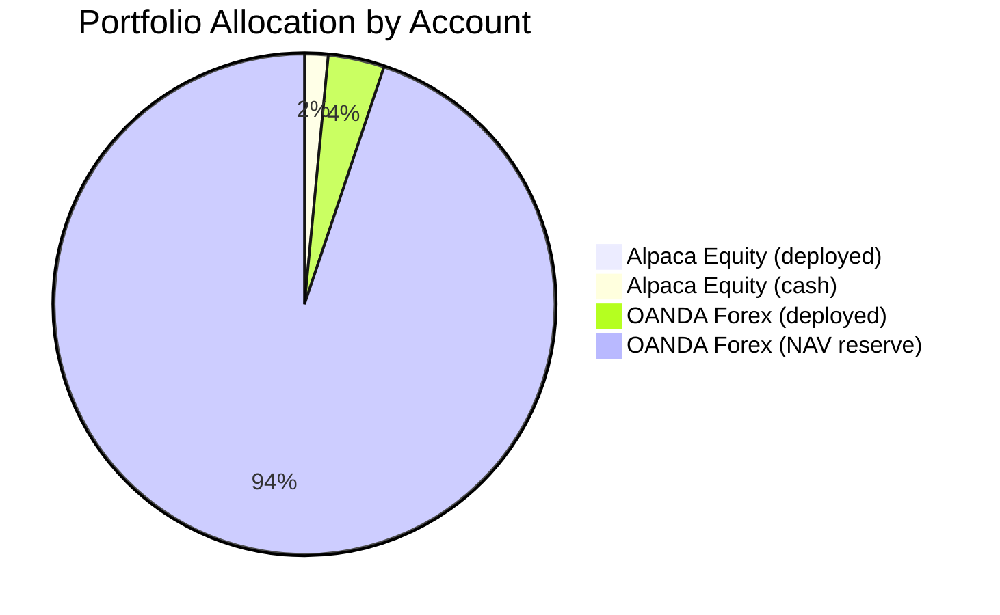
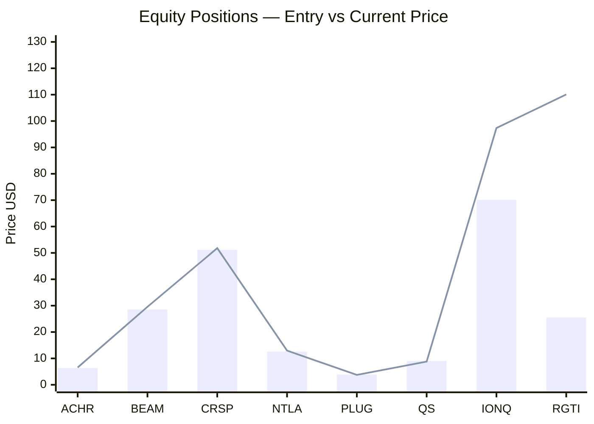
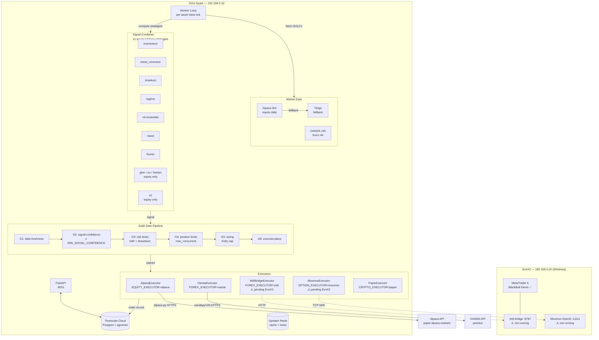
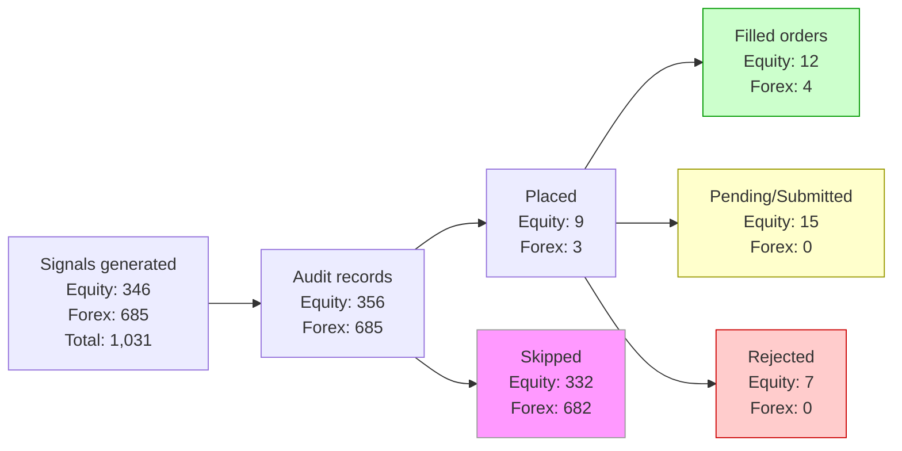
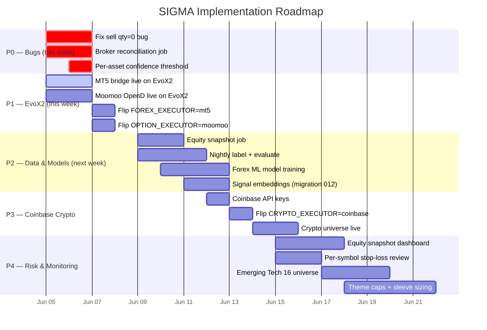
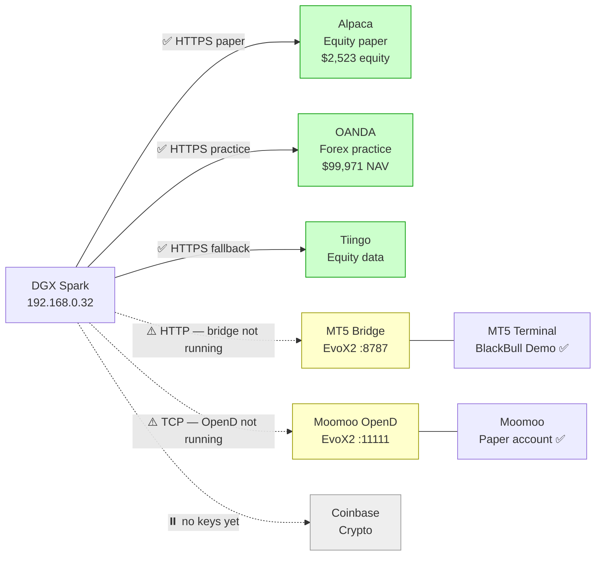

# SIGMA — Trade Report & Pipeline Status
**Date:** 2026-06-05 | **Branch:** `integrate/synthetic-providers`

---

## 1. Portfolio Overview



| Account | NAV / Equity | Cash | Deployed | Unrealized P&L | Realized P&L |
|---|---|---|---|---|---|
| Alpaca Paper (equity) | **$2,523.28** | $1,537.47 | $985.81 | **+$3.60** | **+$9.17** |
| OANDA Practice (forex) | **$99,971.26** | — | ~$3,681 | **-$4.61** | **-$23.17** |
| Moomoo Paper (options) | pending EvoX2 | — | — | — | — |
| Coinbase Paper (crypto) | not configured | — | — | — | — |

**Combined P&L today:** +$24.69 (Alpaca) | -$5.35 unrealized (OANDA)

---

## 2. Open Positions

### Equity (Alpaca Paper)



| Symbol | Theme | Qty | Entry | Current | Mkt Value | Unrealized P&L | Status |
|---|---|---|---|---|---|---|---|
| BEAM | Gene editing | 4.14 | $28.52 | $29.56 | $135.67 | **+$4.31** | ✅ |
| NTLA | Gene editing | 6.26 | $12.59 | $12.95 | $91.26 | **+$2.22** | ✅ |
| CRSP | Gene editing | 2.88 | $51.17 | $51.80 | $162.16 | **+$1.81** | ✅ |
| ACHR | eVTOL | 12.52 | $6.39 | $6.55 | $79.76 | **+$1.94** | ✅ |
| PLUG | Hydrogen | 18.51 | $3.90 | $3.74 | $66.64 | -$3.05 | ⚠️ |
| QS | Battery | 15.45 | $9.03 | $8.80 | $139.19 | -$3.63 | ⚠️ |
| IONQ | Quantum | 1.52 | $70.08 | $97.34 | $97.34 | -$9.25 | ⚠️ DB lag |
| RGTI | Quantum | 4.68 | $25.53 | $110.07 | $110.07 | -$9.41 | ⚠️ DB lag |

> IONQ and RGTI show as losses in DB but are large winners on Alpaca — their submitted orders landed but DB position tracking wasn't updated (see §5 Bug #2).

### Forex (OANDA Practice)

| Pair | Units | Entry | Current | P&L | Opened |
|---|---|---|---|---|---|
| GBP_USD | 2,735 long | 1.34478 | 1.34310 | **-$5.36** | 2026-06-03 |
| USD_JPY | 19 long | 159.871 | 159.870 | +$0.01 | 2026-06-04 |

### Closed Positions

| Symbol | Asset Class | Entry | Exit | Realized P&L | Date |
|---|---|---|---|---|---|
| SPCE | equity | $4.65 | $4.87 | **+$10.55** | 2026-06-03 |
| SLDP | equity | $3.42 | $3.40 | -$0.54 | 2026-06-03 |
| SMR | equity | $12.60 | $12.43 | -$0.84 | 2026-06-03 |
| AUD_USD | forex | 0.71713 | 0.71271 | **-$23.17** | 2026-06-04 |

---

## 3. Execution Pipeline



---

## 4. Signal & Gate Funnel (All-Time)



### Gate Pass Rates

| Asset | Total Evals | Placed | Skipped | Place Rate | Fill Rate |
|---|---|---|---|---|---|
| Equity | 356 | 9 | 332 | 2.5% | 75% (9/12 — 3 stuck) |
| Forex | 685 | 3 | 682 | 0.4% | 100% (3/3) |

**Forex 99.6% skip rate** — all recent forex audit records show `last_gate=-` (skipped before any gate). Root cause: avg forex confidence is **0.252**, below `MIN_SIGNAL_CONFIDENCE=0.3`.

---

## 5. Known Bugs

### Bug #1 — Sell orders placed with qty=0 (5 rejected)

```
2026-06-03 sell ACHR qty=0  [rejected]
2026-06-03 sell NTLA qty=0  [rejected]
2026-06-03 sell QS   qty=0  [rejected]
2026-06-03 sell PLUG qty=0  [rejected]
2026-06-03 sell BEAM qty=0  [rejected]
```

**Root cause:** The worker's sizing logic reads position qty from the DB at sell time, but the DB `positions.qty` is set to 0 after a partial close. The Alpaca executor correctly rejects qty=0 orders — but the signal shouldn't reach the executor.

**Fix needed:** Before placing a sell, resolve qty from `AlpacaExecutor.get_positions()` (live broker state) rather than trusting the DB qty field alone.

### Bug #2 — Submitted orders with qty=0 never reconciled (3 stuck)

```
2026-06-03 buy QBTS qty=0  [submitted]  ← DB says submitted, Alpaca says filled
2026-06-03 buy RGTI qty=0  [submitted]  ← same
2026-06-03 buy IONQ qty=0  [submitted]  ← same
```

**Root cause:** These orders landed on Alpaca (confirmed by broker positions showing IONQ and RGTI held) but the DB records show qty=0 and status=submitted. The fill reconciliation callback didn't fire or wasn't persisted.

**Fix needed:** Add a reconciliation job that syncs DB orders/positions against broker state on startup and periodically. Alpaca's `/v2/orders?status=all` is the source of truth.

### Bug #3 — Forex signals always skipped (99.6% skip rate)

**Root cause:** Forex combiner avg confidence = 0.252 < `MIN_SIGNAL_CONFIDENCE=0.3` threshold. The 7-strategy forex set (no SDE/ICT) produces weaker signal agreement than the 11-strategy equity set.

**Fix options:**
- Lower `MIN_SIGNAL_CONFIDENCE=0.15` for forex only (per-asset threshold)
- Add per-asset-class confidence config to `Settings`
- Train a forex-specific ML model (currently all asset classes share one model)

---

## 6. What to Implement Next



### Prioritized Action List

#### P0 — Fix now (blocking correctness)

| # | Item | File | Fix |
|---|---|---|---|
| 1 | **Sell qty=0 rejected** | `apps/worker/tick.py` | Resolve sell qty from live broker positions, not DB |
| 2 | **Submitted orders stuck** | `apps/worker/tick.py` | Add startup + periodic Alpaca fill reconciliation |
| 3 | **Forex confidence too low** | `apps/api/config.py` | Add `min_signal_confidence_forex: float = 0.15` |

#### P1 — EvoX2 (unblocked by user action)

| # | Item | Command |
|---|---|---|
| 1 | Start MT5 bridge on EvoX2 | `EVOX2_SETUP.md §1` |
| 2 | Start Moomoo OpenD on EvoX2 | `EVOX2_SETUP.md §2` |
| 3 | Activate from DGX | `python scripts/activate_evox2.py` |

#### P2 — Data pipeline completeness

| # | Item | Value |
|---|---|---|
| 1 | **Equity snapshots** — 0 rows in DB | Needed for portfolio dashboard + equity curve |
| 2 | **Nightly label + evaluate** — no model evaluations yet | ML loop is live but hasn't completed one nightly cycle |
| 3 | **Forex ML model** — currently using equity model for forex | Separate training run: `python scripts/train_models.py --asset-class forex` |
| 4 | **Signal embeddings** — migration 012 applied, job not run | `python scripts/embed_signals.py --asset-class equity` |

#### P3 — Coinbase crypto

Currently `CRYPTO_EXECUTOR=paper` — signals are generated but no orders placed. Get API keys from Coinbase Advanced Trade, set `COINBASE_API_KEY_NAME` + `COINBASE_PRIVATE_KEY`, flip to `CRYPTO_EXECUTOR=coinbase`.

#### P4 — Portfolio risk & Emerging Tech 16

The current `EQUITY_UNIVERSE` (AAPL, MSFT, NVDA, GOOG, AMZN) is mega-cap only. The research-grade Emerging Tech 16 universe (`IONQ,RGTI,QBTS,QUBT,RKLB,JOBY,ACHR,QS,SLDP,SMR,CRSP,NTLA,BEAM,BE,PLUG,SPCE`) is already trading on Alpaca via the worker but needs:
- Theme caps (quantum ≤ 4 positions, hydrogen ≤ 2, etc.)
- Speculative sleeve size limits (QUBT, SPCE)
- Formal `EQUITY_UNIVERSE` env update + model retrain

---

## 7. Account Connection Status



| Account | Status | Next Action |
|---|---|---|
| Alpaca Paper | ✅ Live | Fix sell qty=0 bug |
| OANDA Practice | ✅ Live | Lower forex confidence threshold |
| MT5 / BlackBull Demo | ⚠️ Bridge not running | Start on EvoX2 per EVOX2_SETUP.md §1 |
| Moomoo Paper | ⚠️ OpenD not running | Start on EvoX2 per EVOX2_SETUP.md §2 |
| Coinbase Paper | ⏸️ No keys | Get Advanced Trade API keys |

---

*Generated from live Alpaca, OANDA, and Timescale Cloud data — 2026-06-05*
