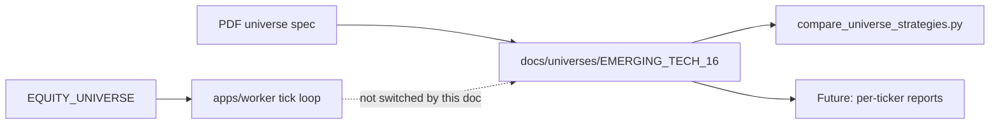

# Emerging Tech 16 — canonical universe

Research-aligned **16-ticker** equity universe for Sigma / TradeFluxSimulator, derived from the operator PDF *Emerging Technology Stock Universe Report* (June 2, 2026). The PDF is a **research report**, not equal-weight allocation instructions.

**Do not change the live worker universe from this doc alone.** Production paper today uses mega-cap `EQUITY_UNIVERSE` (see [Work plan](./EMERGING_TECH_WORK_PLAN.md)). Use this list for **reporting, CLI comparison, and future live expansion** when explicitly promoted.

---

## Final 16 (bot-ready)

| Ticker | Theme | Role | Risk tier | Notes (from PDF) |
|--------|-------|------|-----------|------------------|
| IONQ | Quantum | Primary anchor | High | Pure-play quantum leader; sector anchor |
| RGTI | Quantum | Secondary | Very high | Momentum confirmation; size below IONQ |
| QBTS | Quantum | Secondary | Very high | Annealing / optimization breadth |
| QUBT | Quantum | Speculative sleeve | Very high | Small sleeve only; volume-confirmed breakouts |
| RKLB | Space | Primary | High | Launch + satellite infrastructure |
| JOBY | eVTOL | Primary | High | FAA / defense / certification catalysts |
| ACHR | eVTOL | Primary | High | Peer confirmation with JOBY |
| QS | Battery | Primary | High | Solid-state battery anchor |
| SLDP | Battery | Secondary | High | Sector breadth / second-leg momentum |
| SMR | Nuclear (SMR) | Primary | High | Grid, AI power, public-sector energy narratives |
| CRSP | Biotech (gene editing) | Primary | High / event-driven | Clinical / regulatory catalysts |
| NTLA | Biotech (gene editing) | Primary | High / event-driven | CRISPR clinical catalyst profile |
| BEAM | Biotech (gene editing) | Secondary | High / event-driven | Base-editing; size below CRSP/NTLA |
| BE | Hydrogen / power | Primary (within hydrogen) | High | More grounded fuel-cell / power infra than peers |
| PLUG | Hydrogen | Secondary | Very high | High-beta; strict drawdown controls |
| SPCE | Space | Speculative sleeve | Extreme | Event-driven sentiment proxy only |

**Comma-separated (copy-paste):**

```text
IONQ,RGTI,QBTS,QUBT,RKLB,JOBY,ACHR,QS,SLDP,SMR,CRSP,NTLA,BEAM,BE,PLUG,SPCE
```

### Theme pairs (sector confirmation)

Use paired moves to distinguish single-name noise from theme rotation (PDF guidance):

| Theme | Pair / group |
|-------|----------------|
| Quantum | IONQ, RGTI, QBTS, QUBT |
| eVTOL | JOBY, ACHR |
| Battery | QS, SLDP |
| Gene editing | CRSP, NTLA, BEAM |
| Hydrogen | BE, PLUG |
| Space | RKLB, SPCE (SPCE speculative only) |
| Nuclear | SMR (single name in basket; macro confirm via public-sector layer — see work plan) |

### Speculative sleeve (PDF)

Names flagged for **smaller max exposure** than primaries: **QUBT**, **SPCE**. Full implementation (theme caps + sleeve sizing) is **not** in Sigma yet — tracked in [EMERGING_TECH_WORK_PLAN.md](./EMERGING_TECH_WORK_PLAN.md).

---

## Removed — never use

These symbols must **not** appear in `EQUITY_UNIVERSE`, compare CLI runs, or training universes without an explicit hygiene override.

| Ticker | Reason |
|--------|--------|
| LILM | Delisted / insolvency-related Nasdaq suspension |
| ASTR | Take-private (Jul 2024); no longer public |
| MMAT | Chapter 7 bankruptcy / liquidation risk |
| BLUE | Acquired; common stock ceased trading |
| IRBT | Chapter 11 / restructuring; unsuitable for public bot rules |

---

## Renamed — map, do not trade stale tickers

| Old | Current | Action |
|-----|---------|--------|
| RWLK | LFWD | Watchlist / low-liquidity medical-device speculation only |
| EKSO | CHRN | Watchlist / renamed microcap (Nasdaq ticker change May 2026) |

Sigma has no symbol-alias registry today; any future YAML universe registry should block old tickers and map to canonical symbols.

---

## Watchlist (optional — not in core 16)

Use for **sector confirmation or event-only** trades per PDF; omit from first production basket to limit correlation and hygiene risk.

| Ticker | Sector / theme | PDF action | Risk |
|--------|----------------|------------|------|
| EVTL | eVTOL | Watchlist / event-driven | Very high |
| EH | eVTOL / AAM | Watchlist / event-driven | Very high |
| BLDP | Hydrogen | Watchlist / sector follower | High |
| FCEL | Hydrogen | Watchlist / speculative only | Very high |
| EDIT | Gene editing | Watchlist / sector follower | Very high |
| DNA | Synthetic biology | Watchlist / sector follower | Very high |
| TWST | Synthetic biology | Watchlist / higher-quality peer | High |
| LFWD | Robotics (ex-RWLK) | Rename + watchlist only | Very high |
| CHRN | Robotics (ex-EKSO) | Rename + watchlist only | Very high |
| MNTS | Space | Quarantine / special situations | Extreme |

---

## How this relates to `EQUITY_UNIVERSE`

| Mode | Config | Tickers | Purpose |
|------|--------|---------|---------|
| **Live worker (today)** | `EQUITY_UNIVERSE` in `apps/api/.env` / Fly `[env]` | Mega-caps (e.g. `AAPL,MSFT,NVDA,GOOG,AMZN`) | DGX-first M1 paper loop; ensemble trained on liquid names |
| **Code default** | `StaticEquityUniverse` in `apps/api/universe/equity_static.py` | Same mega-cap default if env unset | Worker + API universe selector |
| **Report / research** | CLI `--symbols` or future preset | Emerging Tech 16 | No order placement; historical signal comparison |
| **Future live** | Change `EQUITY_UNIVERSE` + retrain + Alpaca tradability | Emerging Tech 16 (or subset) | Only after work-plan **live trading** items complete |



**Data already accumulating for mega-caps:** `audit_records`, `signal_history` (Tiger/Timescale) reflect whatever symbols the worker trades. Emerging-tech symbols **do not** appear there until the worker runs them or you backfill via separate jobs.

---

## PDF strategy framework (reference only)

Sigma’s worker uses combiner + ensemble today; the PDF’s layered rules engine is **aspirational alignment**, not current implementation:

| Layer | PDF intent | Sigma today |
|-------|------------|-------------|
| Trend / momentum / volume / volatility | Deterministic gates | Partially via strategy modules + combiner |
| Theme caps / speculative sleeve | Portfolio constraints | **Not implemented** |
| 2-of-N signal confirmations | Entry gating | **Not implemented** |
| Public-sector validation | Macro confirm (IBM, NVDA, LMT, …) | **Parking lot** |

See [EMERGING_TECH_WORK_PLAN.md](./EMERGING_TECH_WORK_PLAN.md) for phased delivery.

---

## References

- Operator PDF: `~/emerging_tech_trading_universe_report.pdf` (June 2, 2026) — read-only; do not commit.
- Index: [README.md](./README.md)
- Execution tracking: [EMERGING_TECH_WORK_PLAN.md](./EMERGING_TECH_WORK_PLAN.md)
- Models / CLI: [MODELS.md](../MODELS.md) — Strategy comparison CLI
- Roadmap M1: [ROADMAP.md](../ROADMAP.md)
